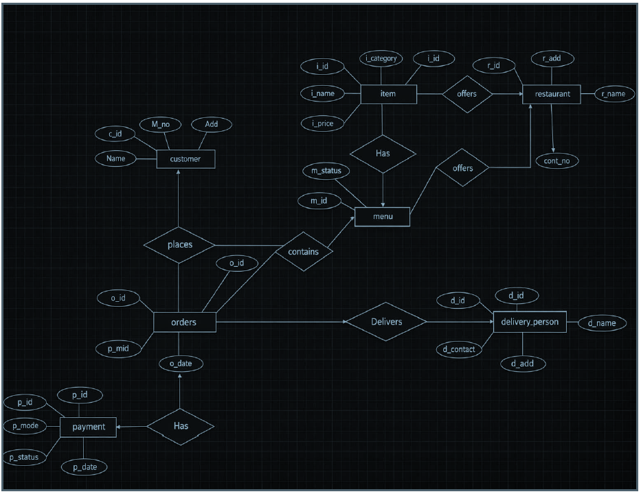
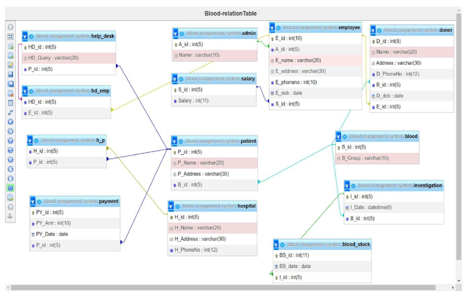

# Online Food Ordering System (DBMS)

## Overview
Online Food Ordering System is a DBMS project developed to manage customers, restaurants, menus, orders, payments, and delivery operations.

## Team Members
- Yashil Pandya
- Harsh Modi
- Vansh Panchal

## Features
- Customer Management
- Restaurant Management
- Menu Management
- Order Processing
- Payment Tracking
- Delivery Management

## ER Diagram

## Relational Schema

## Documentation

📄 Project Report:
[Online Food Ordering System.pdf](Online Food Ordering System.pdf)

## Technologies Used
- SQL
- DBMS
- PostgreSQL/MySQL
